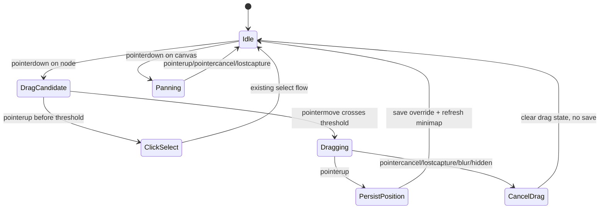

# feat: Add manual graph node dragging

## Overview

Add single-node drag adjustment to the existing wash knowledge graph. The implementation extends the current offline HTML graph runtime: users drag one visible node, connected edges follow during movement, the final position is saved for the current generated graph page, and a reset action restores automatic layout.

The plan keeps the current renderer and graph data contract. It focuses on runtime state, coordinate conversion, local persistence, reset behavior, and tests that prove the new interaction does not break existing canvas navigation, search, minimap, or reading flows.

---

## Problem Frame

Issue #43 reports that automatic graph layout can overlap important nodes or obscure a node during viewing and demos. The current graph already supports canvas pan, zoom, fit-to-view, minimap navigation, search, filters, and selected-node reading state, but users cannot manually adjust an individual node. The design decision is to add node drag inside the existing graph runtime rather than importing a graph library or changing `graph-data.json` (see origin: `docs/superpowers/specs/2026-05-13-graph-node-drag-design.md`).

---

## Requirements Trace

- R1. Users can drag a single visible graph node.
- R2. Connected edges visually follow the dragged node in real time.
- R3. Dragging is distinct from clicking; click-to-select still works when movement stays under the drag threshold.
- R4. Final node positions persist across reloads for the same generated graph page when the graph fingerprint still matches.
- R5. Manual positions are isolated by `getWikiStorageNamespace(meta, pathname)`: wiki title plus a pathname-derived hash. They do not intentionally carry across moved HTML paths or other wikis.
- R6. Users can reset manual positions and return to automatic layout.
- R7. Existing graph flows continue to work: pan, zoom, fit view, minimap click, search query, community selection, edge filters, focus mode, selected-node state, and responsive layout.
- R8. The feature adds no new graph runtime dependency and keeps generated HTML offline.
- R9. Drag is discoverable and recoverable: nodes expose pointer affordances, dragging has a visible state, touch drag does not steal canvas gestures accidentally, and keyboard users can still use existing graph navigation plus reset layout.

---

## Scope Boundaries

- No multi-node selection or group dragging.
- No graph relationship editing.
- No persistence back into markdown, `graph-data.json`, or repository files.
- No browser-to-browser or device-to-device position sync.
- No replacement of the wash renderer with React Flow, Cytoscape.js, vis-network, D3 Drag, or another graph library.
- No broad automatic dense-layout solver beyond manual adjustment and reset.
- No keyboard-based layout editing in the first version; pointer drag is the primary manual adjustment path.

---

## Context & Research

### Relevant Code and Patterns

- `templates/graph-styles/wash/graph-wash.js` owns runtime state, rendering, canvas pan/zoom, minimap navigation, search, filters, drawer state, and toolbar controls.
- `templates/graph-styles/wash/graph-wash-helpers.js` owns pure graph helpers, layout derivation, viewport math, storage namespace generation, and CommonJS/browser exports for tests and runtime.
- `templates/graph-styles/wash/header.html` owns the canvas toolbar, node styles, responsive CSS, and generated HTML shell markup.
- `tests/js/graph-wash-runtime-state.test.js` already covers visible graph state, layout coordinate space, viewport math, and minimap coordinate conversion.
- `tests/js/graph-wash-queue.test.js` already covers wiki storage namespace stability.
- `tests/graph-html-toolbar.regression-1.sh` and `tests/graph-html-minimap.regression-1.sh` show the current shell regression pattern for generated HTML and copied runtime assets.

### Institutional Learnings

- `docs/solutions/developer-experience/graph-style-simplification-to-wash-only-2026-04-20.md`: earlier vis-network work passed automated checks but produced poor readability. Keep this work inside the wash renderer.
- `docs/solutions/best-practices/learning-cockpit-visible-state-reframe-2026-04-24.md`: graph UI state must have one source of truth, local storage must be wiki-scoped, and tests should prove runtime state rather than only strings.
- `docs/solutions/ui-bugs/graph-wash-null-safety-and-label-truncation-fix-2026-04-21.md`: graph tests should combine static shell checks with runtime assertions; optional DOM references must be guarded.
- `docs/plans/2026-04-28-001-refactor-oriental-atlas-usability-plan.md`: pointer-heavy canvas interactions should update transforms or the minimum affected elements, not rebuild the whole graph every frame.

### External References

- React Flow / xyflow separates drag start, drag, and drag stop, and its save/restore example persists graph state after user action: https://github.com/xyflow/xyflow and https://github.com/xyflow/web/blob/main/apps/example-apps/react/examples/interaction/save-and-restore/App.jsx
- vis-network treats positions as first-class state through position read/store/move APIs: https://github.com/visjs/vis-network
- Cytoscape.js exposes drag/free/dragfree lifecycle events, reinforcing save-on-release rather than save-on-move: https://github.com/cytoscape/cytoscape.js
- D3 Drag provides a low-level pointer lifecycle model, but the project should use native pointer events to avoid a new dependency: https://github.com/d3/d3-drag

---

## Key Technical Decisions

- Use native pointer events: The current graph already handles pointer pan and wheel zoom directly, so node drag should extend that model instead of adding a dependency.
- Save only manual overrides: Persisting every node would make stale layout data harder to reason about after graph content changes.
- Save on pointer release only: This avoids writing local storage on every movement frame.
- Apply saved positions during layout derivation: Restored positions should be part of the same model coordinate system used by nodes, edges, bounds, minimap, and fit view. A manual override wins over an explicit graph-data coordinate for rendering; reset removes the override so the graph-data coordinate is used again, or automatic layout is used when no graph-data coordinate exists.
- Keep automatic layout recoverable: Reset should rebuild coordinates from raw `DATA`; dragged coordinates must not become indistinguishable from original graph-data coordinates after they are applied at runtime.
- Tie saved positions to graph content: Persist a lightweight graph fingerprint with the manual-position payload and ignore saved positions when the fingerprint no longer matches.
- Use actual atlas dimensions for drag conversion: Fixed conversion constants would drift when the canvas size changes.
- Clamp live and restored positions: A node should not be draggable or restorable outside the atlas-safe range.
- Add a reset control: Manual adjustment needs a visible escape hatch so users can return to automatic layout.

---

## Open Questions

### Resolved During Planning

- Should the implementation replace the graph renderer? No. Prior project experience and the origin design both point to extending the wash runtime.
- Should node positions be saved globally? No. They must use the existing wiki namespace pattern.
- Should drag save continuously? No. The final position is saved after release.
- Should reset clear filters and search? No. Reset clears manual positions; current search query, community selection, edge filters, focus mode, and selected-node state should remain as long as the selected node still exists.
- Can existing JS tests directly test private browser event handlers? No. Drag calculation and state-transition decisions should move into exported helper functions for Node tests; actual DOM pointer behavior must be verified with a real generated graph in browser automation.

### Deferred to Implementation

- Exact helper names: The plan defines behavior and files, but final names can follow the implementing agent's local refactor choices.
- Exact browser automation tool: The repository does not currently provide a committed browser-test runner. The implementation must still run an automated real-page check with the available browser tool and record the command/tool flow and result in `test-report.md`; static grep checks or manual visual inspection are not enough.

---

## High-Level Technical Design

> *This illustrates the intended approach and is directional guidance for review, not implementation specification. The implementing agent should treat it as context, not code to reproduce.*

The core invariant is that graph model coordinates remain the render-time source of truth, while raw `DATA` remains the reset source of truth. Runtime drag temporarily updates the dragged node element and connected edge paths; when released, it updates the render model, saves the override with the current graph fingerprint, and lets existing render/minimap behavior consume the same model state.

---

## Implementation Units

- U1. **Manual Position Helpers and Layout Overrides**

**Goal:** Add pure helper support for loading, normalizing, clamping, and applying manual node positions during layout derivation.

**Requirements:** R4, R5, R8

**Dependencies:** None

**Files:**
- Modify: `templates/graph-styles/wash/graph-wash-helpers.js`
- Test: `tests/js/graph-wash-runtime-state.test.js`
- Test: `tests/js/graph-wash-helpers.test.js`

**Approach:**
- Extend layout derivation so it can receive manual node position overrides without changing `graph-data.json`.
- Normalize a manual-position payload into a map keyed by node ID.
- Accept only existing node IDs, finite `x`/`y` values, a matching graph fingerprint, and the expected versioned object shape.
- Clamp restored positions to the same safe atlas range used by automatic layout.
- Give manual overrides render-time precedence over explicit graph-data coordinates.
- Keep existing behavior for nodes without manual overrides: explicit graph-data coordinates are honored when present; otherwise automatic layout is used.
- Recompute layout from raw `DATA` after reset; do not rely on a separate saved layout snapshot to restore coordinates.
- Export new pure helpers through the existing browser/CommonJS helper export block.

**Execution note:** Add helper coverage before wiring runtime storage, because bad stored coordinates are easier to characterize in pure tests than through the browser runtime.

**Patterns to follow:**
- `deriveAtlasLayout()` in `templates/graph-styles/wash/graph-wash-helpers.js`
- `normalizeQueue()` and `getWikiStorageNamespace()` in `templates/graph-styles/wash/graph-wash-helpers.js`
- Existing atlas layout tests in `tests/js/graph-wash-runtime-state.test.js`

**Test scenarios:**
- Happy path: Given a model with node `a` and manual position `{ x: 42.5, y: 61.25 }`, layout uses that position for `a`.
- Edge case: Given manual positions for unknown node IDs, layout ignores them and still lays out known nodes.
- Edge case: Given invalid coordinates such as missing values, strings, `NaN`, or infinities, normalization drops those entries.
- Edge case: Given out-of-range coordinates, layout clamps them to atlas-safe bounds.
- Edge case: Given a saved payload whose graph fingerprint does not match current graph content, layout ignores the saved positions.
- Integration: Existing `x: null` / `y: null` behavior still treats coordinates as missing and uses automatic layout.
- Integration: After a manual override is cleared, the node returns to its automatic or original graph-data coordinate rather than staying at the last dragged coordinate.

**Verification:**
- Layout helpers continue to derive one coordinate space for nodes, edges, bounds, viewport fit, and minimap mapping.
- No graph data fixture shape changes are required.

---

- U2. **Wiki-Scoped Runtime Persistence**

**Goal:** Load manual positions before layout, persist only moved nodes after drag, and clear saved positions when reset is requested.

**Requirements:** R4, R5, R6, R8

**Dependencies:** U1

**Files:**
- Modify: `templates/graph-styles/wash/graph-wash.js`
- Modify: `templates/graph-styles/wash/graph-wash-helpers.js`
- Test: `tests/js/graph-wash-queue.test.js`
- Test: `tests/js/graph-wash-runtime-state.test.js`

**Approach:**
- Reorder startup so safe storage and the wiki namespace are available before final render layout consumes saved positions.
- Reuse `getWikiStorageNamespace(meta, pathname)` rather than introducing a global key. The namespace is based on wiki title plus a pathname-derived hash, so positions persist for the same generated graph page/path and do not intentionally move with renamed or relocated HTML files.
- Store only nodes that users moved manually, preserving automatic layout for the rest.
- Store a versioned payload containing graph fingerprint and moved-node positions.
- Treat blocked storage, invalid stored JSON, or missing local storage as non-fatal; the graph still works for the current session.
- Provide one clear internal path for clearing manual positions so reset behavior and tests share the same contract.
- Keep raw `DATA` available so reset can recompute automatic coordinates instead of reusing a model already mutated by drag.

**Patterns to follow:**
- `createSafeStorage()` and `queueStorageKey()` usage in `templates/graph-styles/wash/graph-wash.js`
- Queue namespace tests in `tests/js/graph-wash-queue.test.js`
- Bootstrap storage-failure coverage in `tests/js/graph-wash-bootstrap.test.js`

**Test scenarios:**
- Happy path: Given a saved manual position under a wiki-scoped key, runtime startup passes that position into layout.
- Edge case: Given identical wiki titles but different page paths, storage namespaces differ and positions do not cross-contaminate.
- Edge case: Given an identical wiki title and path but changed graph content, a graph fingerprint mismatch ignores old saved positions.
- Error path: Given invalid stored JSON, runtime falls back to automatic layout without throwing.
- Error path: Given local storage getter or setter failure, runtime logs through the safe storage path and keeps graph rendering usable.
- Integration: Reset clears the manual-position key for the current graph page namespace while leaving queue and neighbor-collapse state untouched.
- Integration: Reset after a drag rebuilds from raw `DATA` and does not preserve the dragged coordinate as if it came from `graph-data.json`.

**Verification:**
- Manual positions survive reload for the same generated graph page when the graph fingerprint matches.
- Manual positions from one wiki or page path do not appear in another wiki or page path.

---

- U3. **Node Drag Lifecycle and Connected Edge Updates**

**Goal:** Add pointer-driven single-node dragging that updates only the dragged node and connected edge paths during movement.

**Requirements:** R1, R2, R3, R7, R8

**Dependencies:** U1, U2

**Files:**
- Modify: `templates/graph-styles/wash/graph-wash.js`
- Modify: `templates/graph-styles/wash/graph-wash-helpers.js`
- Test: `tests/js/graph-wash-runtime-state.test.js`
- Test: `tests/graph-html-node-drag.regression-1.sh`

**Approach:**
- Add a node drag state next to the existing pan state.
- Move drag math and decisions into small exported helpers that the runtime calls: movement threshold, screen-delta to atlas-delta conversion, safe-range clamping, second-pointer rejection, cancel/finalize outcomes, and connected-edge filtering.
- On primary pointer down over a node, start a drag candidate and capture the pointer without selecting the node yet.
- Ignore secondary pointers while a drag or pan is active, and keep touch behavior consistent with mouse behavior.
- Use a movement threshold so tiny movement still behaves like a click. The threshold applies to touch too.
- Convert screen movement into atlas-percent movement using current canvas dimensions and viewport scale.
- Clamp live drag coordinates to the atlas-safe range before updating the node or saving.
- During drag, update the dragged node's `left` / `top` style and only the edge paths connected to that node.
- On pointer release, update model coordinates and persist the override.
- On pointer cancel, lost pointer capture, window blur, page visibility change, or rerender that removes the active node, clear drag state and avoid persistence.
- Suppress the post-drag click only when the node actually moved past the threshold.

**Patterns to follow:**
- Existing `panState` lifecycle in `setupViewportInteractions()`
- Existing `makePath()` and edge `data-from` / `data-to` attributes in `renderCanvas()`
- Existing viewport helper tests in `tests/js/graph-wash-runtime-state.test.js`
- Existing CommonJS/browser helper export pattern in `templates/graph-styles/wash/graph-wash-helpers.js`

**Test scenarios:**
- Helper happy path: Given a drag candidate for node `a`, movement beyond threshold returns a dragging outcome with clamped atlas coordinates and a finalizable manual override.
- Helper happy path: Given connected edges for node `a`, connected-edge filtering returns only edges where `data-from` or `data-to` references `a`.
- Helper edge case: Movement below the threshold returns a click-select outcome and no persistable position.
- Helper edge case: Drag conversion uses actual atlas dimensions and viewport scale, so the same screen movement produces smaller model movement when zoomed in.
- Helper edge case: Dragging beyond the canvas edge clamps live and saved coordinates to the atlas-safe range.
- Helper error path: Pointer cancel, lost capture, blur, visibility change, or active-node removal returns a cancel outcome and no persistable position.
- Helper error path: A second pointer during an active drag is rejected and does not replace the tracked pointer.
- Integration: Canvas pan still works when pointer down begins on empty canvas, and wheel zoom still works over the canvas and nodes.

**Verification:**
- `tests/js/graph-wash-runtime-state.test.js` should test exported helper outcomes, not private DOM event handlers inside `graph-wash.js`.
- Dragging a node does not rebuild the full graph on every pointer move.
- Connected lines remain visually attached during drag.
- Click-to-select remains intact, and a real drag does not open or select the node after release.

---

- U4. **Reset Layout Control and Drag Visual State**

**Goal:** Expose a clear reset action and add minimal visual feedback for dragged nodes without disrupting existing toolbar layout.

**Requirements:** R3, R6, R7

**Dependencies:** U2, U3

**Files:**
- Modify: `templates/graph-styles/wash/header.html`
- Modify: `templates/graph-styles/wash/graph-wash.js`
- Test: `tests/graph-html-node-drag.regression-1.sh`
- Test: `tests/graph-html-toolbar.regression-1.sh`

**Approach:**
- Add a `恢复布局` toolbar button near existing graph controls.
- Wire the button to clear manual positions, recompute automatic layout from raw `DATA`, and rerender the current view.
- Disable the reset button when there are no manual positions if that fits the existing control pattern; otherwise make it a harmless no-op with no confirmation.
- Preserve search query, community selection, edge filters, focus mode, and selected-node state when reset runs.
- Add an idle/hover/focus affordance for draggable nodes: grab cursor, concise title or accessible label, and a visible dragging state that disables transition, uses a grabbing cursor, raises z-index, and applies a subtle stronger shadow.
- Do not add a persistent per-node "manually moved" marker in the first version unless implementation shows users cannot understand reset state without it.
- Keep touch gesture priority explicit: pointer down on a node starts a node-drag candidate; pointer down on canvas starts pan; drawer and minimap gestures stay scoped to their own controls.
- Keep keyboard support to existing navigation and the reset control; keyboard-based node movement remains out of scope.
- Keep the control readable in existing responsive toolbar layouts.

**Patterns to follow:**
- `fit-view` and `toggle-dim` controls in `templates/graph-styles/wash/header.html`
- `setupControls()` in `templates/graph-styles/wash/graph-wash.js`
- Toolbar shell assertions in `tests/graph-html-toolbar.regression-1.sh`

**Test scenarios:**
- Happy path: Generated HTML contains the `恢复布局` control and runtime hook.
- Happy path: Reset clears manual positions for the current graph page namespace and rerenders automatic coordinates.
- Edge case: Reset with no saved manual positions is a no-op that does not break current graph state.
- Edge case: Reset after a drag does not treat the dragged coordinate as a graph-data coordinate.
- Integration: After reset, current search query, community selection, edge filters, focus mode, and selected-node state remain active and the selected node remains selected if it still exists.
- Integration: Draggable nodes expose visible pointer affordances on hover/focus and a distinct dragging state while active.
- Integration: Mobile and narrow viewport toolbar rules still keep graph controls readable.

**Verification:**
- Users can undo manual node adjustments without clearing unrelated local state.
- Toolbar controls remain understandable and non-overlapping.

---

- U5. **Regression Coverage and Browser Verification**

**Goal:** Add focused regression coverage and perform real generated-HTML verification before the feature is considered complete.

**Requirements:** R1, R2, R3, R4, R5, R6, R7, R8

**Dependencies:** U1, U2, U3, U4

**Files:**
- Create: `tests/graph-html-node-drag.regression-1.sh`
- Modify: `tests/regression.sh`
- Modify: `tests/js/graph-wash-runtime-state.test.js`
- Modify: `tests/js/graph-wash-helpers.test.js`
- Modify: `tests/js/graph-wash-queue.test.js`
- Reference: `tests/fixtures/graph-interactive-basic/wiki/graph-data.json`
- Reference: `tests/fixtures/graph-interactive-multicomm/wiki/graph-data.json`

**Approach:**
- Add a graph HTML regression script dedicated to node drag hooks, reset control, dragging CSS state, and copied runtime assets.
- Extend JS helper/runtime tests for manual position normalization, layout overrides, namespace isolation, graph fingerprint mismatch, threshold behavior, drag coordinate conversion, live clamping, cancel outcomes, and second-pointer rejection.
- Keep static shell checks focused on generated HTML and asset presence; put behavior-sensitive logic in JS tests where possible.
- Run an automated real-page generated graph check during implementation QA that drags a node, confirms a connected edge moved, confirms the drag did not open or select the node, reloads and confirms persistence, resets and confirms coordinates return to raw-data-derived layout, then verifies click-select still works.
- Record the browser automation flow and outcome in `test-report.md`. Because the repo has no browser runner today, do not wire a fake browser check into `tests/regression.sh`; only add one there if the implementation also introduces a real, runnable browser-test command.
- Verify in a real generated graph that drag, refresh persistence, reset, click-select, pan, zoom, minimap click, search query, edge filters, focus mode, and drawer still work.
- Cover at least one normal graph and one multi-community graph so namespace and visible-state behavior are not accidentally single-fixture assumptions.

**Patterns to follow:**
- `tests/graph-html-toolbar.regression-1.sh`
- `tests/graph-html-minimap.regression-1.sh`
- `tests/js/graph-wash-runtime-state.test.js`
- `tests/js/graph-wash-queue.test.js`

**Test scenarios:**
- Happy path: Generated graph assets include node drag runtime hooks, reset layout hook, and dragging CSS.
- Happy path: Runtime helper tests prove manual positions are restored and clamped before layout, and drag helper tests prove threshold, coordinate conversion, live clamping, cancellation, and second-pointer rejection.
- Happy path: Generated HTML graph allows drag, connected-edge movement, no post-drag selection, refresh persistence, reset, and post-reset click-select in automated browser verification recorded in `test-report.md`.
- Edge case: Explicit search/filter empty states still remain empty after manual position support is added.
- Error path: Malformed saved positions do not prevent graph startup.
- Error path: Stale saved positions with a mismatched graph fingerprint do not affect startup layout.
- Integration: Existing graph regressions for toolbar, minimap, density, mobile, drawer neighbors, search, and long labels continue to pass.

**Verification:**
- The new static regression script is included in the repository's graph regression entry point.
- Automated browser verification confirms the real interaction, not only static hooks or manual visual inspection, and its result is captured in `test-report.md`.

---

- U6. **Release Documentation and Version Notes**

**Goal:** Update user-facing release documentation after the feature is implemented and verified.

**Requirements:** R1, R4, R6, R8

**Dependencies:** U5

**Files:**
- Modify: `CHANGELOG.md`
- Modify: `README.md`
- Modify: `README.en.md`
- Modify: `SKILL.md`
- Create or modify: `test-report.md`

**Approach:**
- Add a new changelog entry for the feature, using the next feature version according to the repository's release rules.
- Update the README feature descriptions to mention manual node adjustment, saved local positions, and reset layout behavior.
- Mirror the README update in `README.en.md`.
- Update the skill version metadata and any graph workflow description that should mention the new interaction.
- Produce the required test report from the final verification pass.

**Patterns to follow:**
- Existing `CHANGELOG.md` version sections.
- Current graph highlight rows in `README.md` and `README.en.md`.
- `SKILL.md` graph workflow section.

**Test scenarios:**
- Test expectation: none -- this unit updates documentation and release notes after behavioral verification. Its correctness is reviewed by checking that the docs match the implemented behavior and no private local path is introduced.

**Verification:**
- Public docs describe the shipped behavior without overstating scope.
- Release notes, version metadata, and test report are consistent with the final implementation.

---

## System-Wide Impact

- **Interaction graph:** Node pointer handling now shares the canvas with existing pan, wheel zoom, minimap click, node click, hover highlight, and drawer selection flows. Drag state must be isolated so these flows do not steal each other's pointer lifecycle.
- **Error propagation:** Local storage failures and malformed persisted positions should degrade to automatic layout and warn without blocking graph startup.
- **State lifecycle risks:** Saved manual positions are wiki-local state. They must not overwrite queue state, neighbor collapse state, selected node state, or graph data.
- **API surface parity:** `graph-data.json`, markdown graph output, generated HTML path, install flow, and graph workflow commands remain unchanged.
- **Integration coverage:** Unit tests alone will not prove the drag feels correct. Browser verification of generated HTML is required for drag, refresh persistence, reset, pan, zoom, minimap, and selection.
- **Unchanged invariants:** The graph remains self-contained and offline; no new runtime dependency is introduced.

---

## Risks & Dependencies

| Risk | Mitigation |
|------|------------|
| Drag conversion drifts after zoom or resize | Convert from screen delta using actual canvas dimensions and current viewport scale; cover helper behavior in runtime tests. |
| Drag accidentally triggers click selection | Use movement threshold and suppress only the post-drag click after real movement. |
| Different wikis or moved graph pages share saved positions | Generate manual-position keys from `getWikiStorageNamespace(meta, pathname)` and test namespace separation. |
| Changed graph content reuses stale positions | Store a graph fingerprint with manual positions and ignore payloads whose fingerprint does not match. |
| Full graph rerenders on every pointer move | During drag, update only the dragged node element and connected edge paths; save and rerender only after release/reset. |
| Reset cannot recover automatic layout because runtime mutation polluted node coordinates | Rebuild from raw `DATA` on reset, and test reset after a drag. |
| Reset layout clears too much user state | Clear only manual positions and preserve search query, community selection, edge filters, focus mode, and selected-node state where the selected node still exists. |
| Interrupted pointer lifecycle leaves graph stuck in dragging state | Clear drag state on pointer cancel, lost capture, blur, visibility change, and active-node removal; ignore secondary pointers while active. |
| User drags a node outside the usable graph | Clamp live and saved drag coordinates to atlas-safe bounds. |
| Static tests pass but real drag fails | Add automated browser verification against generated HTML as a required completion outcome. |
| Documentation claims behavior not shipped | Update docs only after implementation and browser verification. |

---

## Documentation / Operational Notes

- Implementation should happen on a feature branch because this is a code change.
- Before push, the repository requires install dry-run validation, relevant graph regression tests, relevant JS tests, privacy-path grep, and a test report.
- Because this is a new feature, update `CHANGELOG.md`, `README.md`, `README.en.md`, and version metadata after verification.
- Do not include issue attachment code verbatim; use it only as a behavior reference. The attachment's global storage key and fixed drag conversion are explicitly rejected by this plan.

---

## Sources & References

- Origin document: `docs/superpowers/specs/2026-05-13-graph-node-drag-design.md`
- Related issue: https://github.com/sdyckjq-lab/llm-wiki-skill/issues/43
- Runtime: `templates/graph-styles/wash/graph-wash.js`
- Helpers: `templates/graph-styles/wash/graph-wash-helpers.js`
- Shell: `templates/graph-styles/wash/header.html`
- Existing JS tests: `tests/js/graph-wash-runtime-state.test.js`, `tests/js/graph-wash-helpers.test.js`, `tests/js/graph-wash-queue.test.js`
- Existing graph shell tests: `tests/graph-html-toolbar.regression-1.sh`, `tests/graph-html-minimap.regression-1.sh`
- Institutional learning: `docs/solutions/best-practices/learning-cockpit-visible-state-reframe-2026-04-24.md`
- Institutional learning: `docs/solutions/developer-experience/graph-style-simplification-to-wash-only-2026-04-20.md`
- Institutional learning: `docs/solutions/ui-bugs/graph-wash-null-safety-and-label-truncation-fix-2026-04-21.md`
- External reference: https://github.com/xyflow/xyflow
- External reference: https://github.com/xyflow/web/blob/main/apps/example-apps/react/examples/interaction/save-and-restore/App.jsx
- External reference: https://github.com/visjs/vis-network
- External reference: https://github.com/cytoscape/cytoscape.js
- External reference: https://github.com/d3/d3-drag
